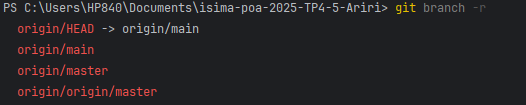
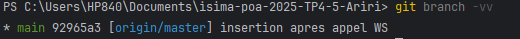

# Travailler avec Git

*Dernière mise à jour : {{ git_revision_date_localized }}*

## Comment déposer un projet sur GitHub/GitLab

### Étape 1 : Initialisation
* Le projet est dans un dossier ; on ouvre le terminal bien sûr dans le dossier et on initialise avec un dépôt git : `git init`

---

### Étape 2 : Committer les fichiers
* La première chose à faire c'est de pré-ranger les fichiers à déposer : dans le premier dépôt nous on veut déposer tous le dossier donc on indique **"."** pour préciser que c'est le dossier courant qui contient tous les fichiers. On tape la commande suivante : `git add .`
* Après on enregistre ce qu'on a préparé avant (on fait ça avec la commande commit) et on ajoute un message : `git commit -m "Initial commit"`

---

### Étape 3 : Création du dépôt distant
* Sur GitHub/GitLab je dois créer un dossier ; et après j'obtiendrai un URL de projet
* Après je dois ajouter un dépôt distant pour créer le lien entre mon PC et GitHub/GitLab avec la commande : `git remote add <NAME> <URL>`
    * **Name :** C'est juste un alias de l'URL pour ne pas le répéter dans tous les commandes.
* Pour vérifier les dépôts distants déjà configurés on tape : `git remote -v`
* Pour changer l'URL d'un dépôt qui existe déjà : `git remote set-url <NAME> <New URL>`

---

### Étape 4 : Push ton code
* Avant de pousser le code je dois créer un branch sur lequel je pousse ; on fait ça avec la commande : `git branch <nom branch>`
* Maintenant on doit envoyer nos commits qui sont local avec la commande : `git push -u <name of distant depot> <branche envoyée>`

---

## Informations sur l'état du dépôt 

* Pour lister les branches distantes (pour les branches locales on eneleve le -r) : `git branch -r`



`origin\HEAD -> origin\main ` : indique la branche principale (default).

`orign\main` : indique une branch distante normale(les autres aussi).

* Pour lister les branches locales et indiquer à queel branches distantes sont liées : `git branch -vv`



`* main` : c'est le nom de la branch locale actuelle.

`92965a3` : le hash dcu dernier commit.

`[origin\master]`:la branche distante liée à main.


## Changer la branche distante de suivi

*c'est à dire le main qui est liée à origin/master comment ja le lie à origin/main ?
```
git push -u origin main #il faut qu'on soit sur la branche locale main 
```

**La commande aussi push ce qui est dans la branch locale vers la branche distante**

## suprrimer une branche distante

* cette commande supprime la branche origin\master : 

```
git push origin --delete master 
```

