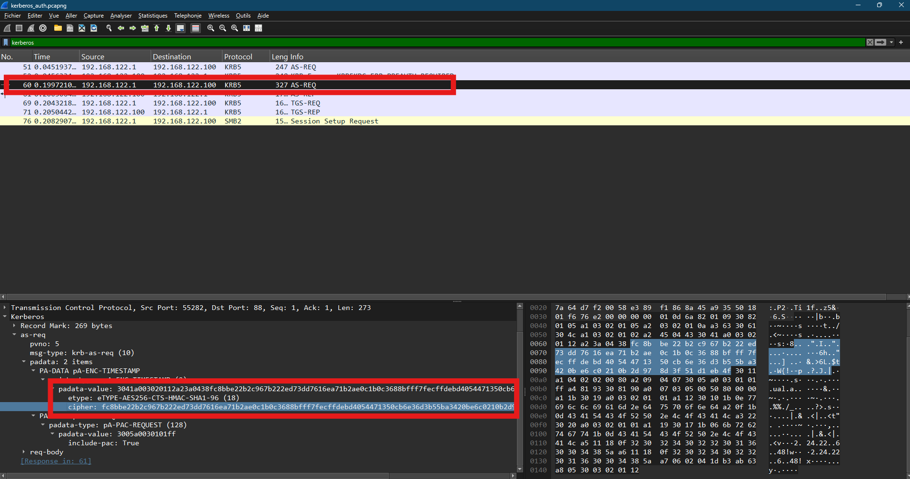

# Active directory Kerberos et AS_REQ
*Dernière mise à jour : {{ git_revision_date_localized }}*

## Fonctionnement 

Pour s'authentifier dans l'active directory aujourd''hui le protocle par défaut est `Kerberos`, L'idée est simple; pour que le client accède au service, il doit récuperer d'abord un ticket de `KDC`, la procédure passe par 3 étapes :

1. Authetification service (AS)
2. Ticket-Granting service (TGS)
3. Accés au service (AP)

```
|-----------------|                     |---------------|                     |---------------|
|       KDC       | <------------------ |     Client    | ------------------> |    Service    |
|-----------------|                     |---------------|                     |---------------|
         ^                               ^
         |                               |

                    <--- KRB_AS_REQ (1)
                    ---> KRB_AS_REP (2) 

                    <--- KRB_TGS_REQ (3)
                    ---> KRB_TGS_REP (4)
    
                                                          ---> KRB_AP_REQ (5)
                                                          <--- KRB_AP_REP (6) 
```
---
### Etape 1 : Authentification service (AS)

#### KRB_AS_REQ 

Envoie du nom du `User` avec l'heure exacte chiffré avec son secret (on chiffre le timestamp que si la `pre-authentication` est activé)

Une demande `AS_REQ` contient : 

- le nom d'utilisateur 
- le timestamp
- le nom de domaine
- le timestamp chiffré


#### KRB_AS_REP

Le `KDC` vérifie sa base, il compare l'heure avec les donnée déchifrées, si tout est bon il envoie 2 informations:

- **TGT** : on le chiffre avec une clé de session de `KDC`:

    - nom du `User`
    - période de validité
    - privilege
    - cle de session 

- **Clé de session** : que le `User` va utiliser pour communiquer après avec le `KDC`

---
### Etape 2 : Ticket-Granting service (TGS)

#### KRB_TGS_REQ

Si le `User`  veut accéder à un service, il envoie au `KDC` : 
- TGT
- l'identifiant du service
- son nom avec l'heure chiffré avec la clé de session 

#### KRB_TGS_REP

Si le `TGT` et l'authenticator (nom + heure) correspond il envoie une réponse : 
- Un nouvel clé de session pour s'authentifier auprés du service;

---
### Etape 3 : Accés au service (AP)

**TO DO**

---

## Unconstrained Delegation

Un client peut s'authentifier auprès d'un service. Cependant, parfois ce service aura besoin d'autres informations pour répondre au client. 

Il existe un drapeau qui peut être placé sur un service pour lui indiquer qu'il peur imprsonner le `user`. 2 possiblité s'offrent : 

- Constrained Delegation : une liste de service.
- Unconstrained Delegation : tous les services.

Si dans un service on a Unconstrained Delegation, l'uitlisateur fournit : 

- `TGT` avec drapeau `Forwarded`, c-à-d qu'il peut demander accée à un service sans besoin de s'authentifier (le service pas la personne).
- clé de session de ce `TGT`.

## Kerberoast

**TO DO**

## Challenge root me Kerberos 

dans ce challenge, on exploite le fait qu'on envoie le `timestamp` chiffré avec une clé derive de notre secret. a partir de ca on peut reconstruire le secret. 



on construit notre hash : 

```
$krb5pa$18$william.dupond$CATCORP.LOCAL$fc8bbe22b2c967b222ed73dd7616ea71b2ae0c1b0c3688bfff7fecffdebd4054471350cb6e36d3b55ba3420be6c0210b2d978d3f51d1eb4f
```

et après on utilise hashcat : 

```
hashcat -m 19900 hash rockyou.txt
```