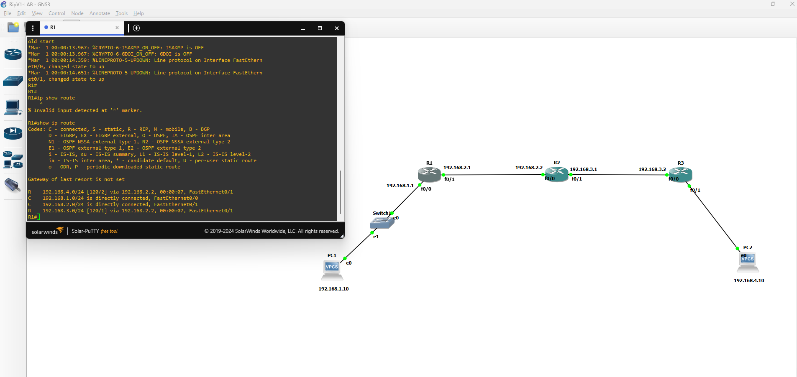

# RIP (Routing Information Protocol)

*Dernière mise à jour : {{ git_revision_date_localized }}*

## Fonctionnement 

Imaginons la situation ci-dessous : 

Au début chaque routeurs construit sa table de routage par défaut; sur chaque table on trouvera 2 entrées,à savoir les deux réseaux connectés directement à notre routeur.



Après activation du RIP, chaque routeur va copier sa table vers son voisin direct avec les métriques. (en supposant que nous avons configuré le R1 en premier les tables de R2 et R3 se mettent à jours)


## Diference entre v1 et v2

* Le RIPv1 est ClassFull , le RIPv2 utilise CIDR

* L'authentification est ajoutée dans le RIPv2

* L'adresse de broadcast est differente dans la version 2


## Configuration sur un routeur Cisco

```
router# conf t
router(config)# router rip
router(config)# version 2 // ou version 1
router(config)# network 192.168.1.0
router(config)# network 192.168.2.0
```

* pour verifier la configuration, on peut utiliser `show running-config | section rip` ou `show ip route`


## Routing Loop

Supposons qu'une interface est down (ex : F0/0 de R3) alors le réseau 192.168.4.0/24 n'est plus joignable. 

**par defaut chaque routeur envoie periodiquement(30s fixe en version 1) sa table**

et donc apres 30 seconde R3 envoie sa table à R2 sans l'entrée qui indique le réseau tombé et donc R2 ne met rien à jour. **LE PROBLEME** c'est quand R2 envoie sa table à R3 avec l'entree 192.168.4.0 et un metric 1 , R3 met à jour sa table en aojutant l'entree 192.168.4.0 et un metric 2. et cela cree une loop 

**Si un metric est fixé à 16, c-a-d c'est l'infinie on peut pas le rejoindre.**

---

Les solution : 
* Split horizon : Un routeur ne ré-annonce pas une route sur l'interface par laquelle il l'a reçue.
* Route poising : lorsqu’une route tombe, on la marque comme inaccessible en utilisant un metric infini
* Poison reverse : annule temporairement la règle du split horizon pour propager la route "empoisonnée".

## Exploitation du RIPv1 : 

L'idée ici c'est d'imaginer un réseaux qui utilise le RIPv1 comme protocole de routage est de voir est ce c'est possible de modifier certaines routes pour soit rediriger le traffic ou au moins empecher le réseau de fonctionner.

**Les messages de RIPv1 sont envoyé en UDP port 520 en utilisant l'adresse de diffusion 255.255.255.255**

### Format d'un packet RIPv1

```
+-------------------------------------------------------------+
|   commande   |   version    |          must be zero         |
+-----+------+---------+--------------------------------------+
|         add family          |          must be zero         |
+-------------------------------------------------------------+
|                          network                            |
+-------------------------------------------------------------+
|                        must be zero                         |
+-------------------------------------------------------------+
|                          next hope                          |
+-------------------------------------------------------------+
|                           metric                            |
+-------------------------------------------------------------+

```

* commande : `0x01` represente un packet **request** et `0x02` represente une **response**
* version : version du rip (dans notre cas `0x01`)
* add family : indique le type d'addresse (dans notre cas `2` pour IP)

### Shéma du réseau 

L'idée de l'exploitaion est évidente, c'est le même shéma en-dessus, il faut juste ajouter une machine unix dans le réseau `192.168.1.0\24` , pour faire ca `gns3` offre 2 possibilite : 

* Lier une VM qui est deja presente sur VirtualBox : dans la configuration de préference je sais pas pourquoi il ne détecte pas `VBoxManage.exe`
* Utiliser un conteneur Docker : j'ai un problème de connexion que j'ai pas pu résoudre (j'ai testé un adapteur bridge avec conf de eth1 sur dhcp => ça marche pas !!).

Donc pour le moment je peux pas tester ça tant que j'ai pas résolue ce problème de machine unix. 

**I HATE YOU GNS3** 